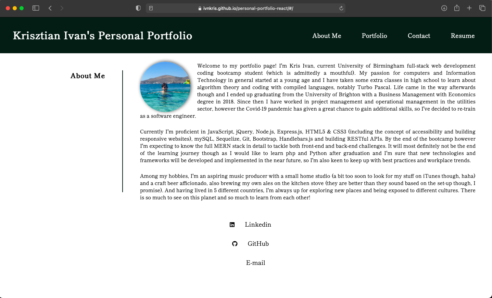
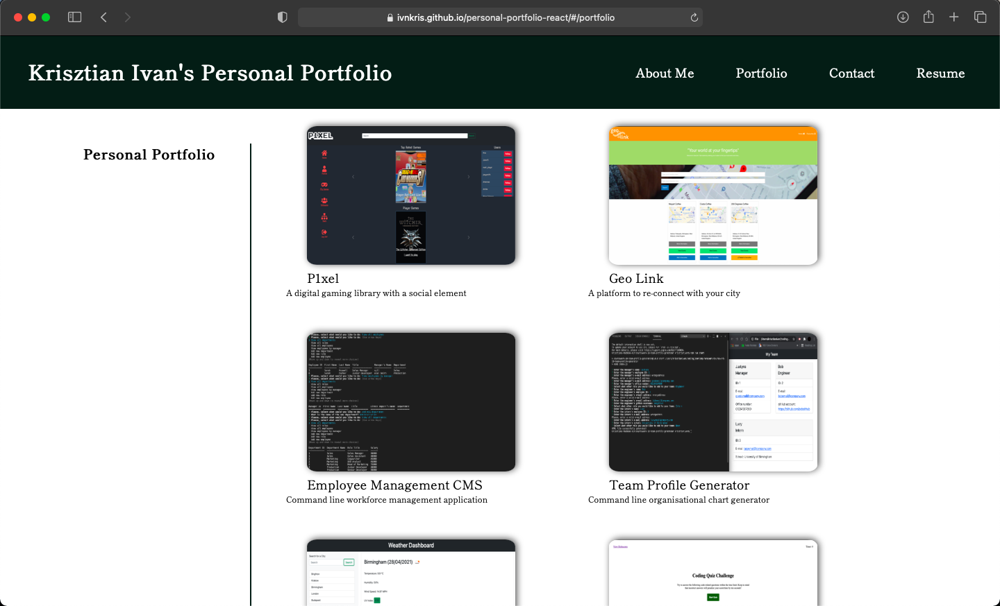
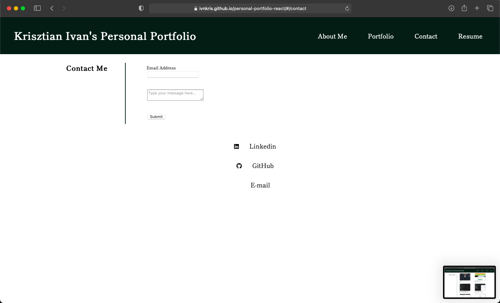

# REACT Portfolio

## Description

In this project I have re-created my personal portfolio using REACT. I have also added a contact form.

## What I've done

- [x] Created REACT pages to navigate within the website
- [x] Created reusable REACT components
- [x] Added the REACT Router for navigation
- [x] Added a contact form
- [x] Deployed to Github Pages

## Link to deployed website

https://ivnkris.github.io/personal-portfolio-react

## Link to GitHub repository

https://github.com/ivnkris/personal-portfolio-react

## Screenshots

